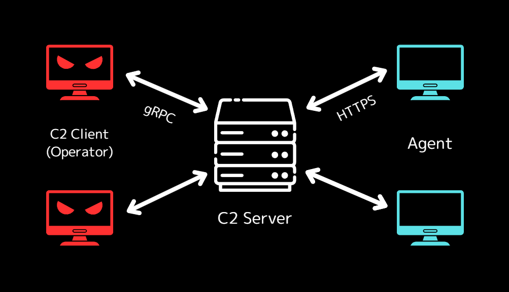

# Hermit C2

A post-exploitation, command and control framework written in Rust.  
I'm developing it to learn how the C2 framework works and learn Rust programming language.



<br />

## FEATURES

This is still in the early stages of development and still has minimal basic functionality.

- C2 server
- C2 client (CLI)
- HTTPS listener
- Implant generation
- AES encryption for each message
- Multi listeners, agents, operators
- Database (SQLite) for the settings persistence

<br />

## UNSUPPORTED FEATURES (YET)

- AV/EDR evasion
- Implant obfuscation
- And other techniques.

<br />

## STATUS

This project is currently under development.  
It does not have features enough for attack simulations yet, and only the basic feature to communicate with target computer.  
However, I'm working to implement those (or new) features.

<br />

## :warning: WARNING

This project is only be used for educational and learning purposes and for experimentation in your own environment.  
It's prohibited to use on systems not under your control.

<br />

## USAGE

<!-- Plese refer to [https://hermit.hdks.org/](the docs) for more details. -->
Please refer to [the documentation](/docs) for more details.

### C2 Server

```sh
$ hermit server


        ┓┏┏┓┳┓┳┳┓┳┏┳┓
        ┣┫┣ ┣┫┃┃┃┃ ┃
        ┛┗┗┛┛┗┛ ┗┻ ┻
          C2 SERVER
      +++++++++++++++++
      DEVELOPED BY HDKS

[2024-01-10T13:59:41Z INFO  hermit::server::certs::https] /home/user/.hermit/server/listeners/listener_3943635548/certs/cert.pem created successfully.
[2024-01-10T13:59:41Z INFO  hermit::server::certs::https] /home/user/.hermit/server/listeners/listener_3943635548/certs/key.pem created successfully.
[2024-01-10T13:59:41Z WARN  hermit::server::db::listeners] Listener already exists in database.
[2024-01-10T13:59:41Z INFO  hermit::server::server] listening on 0.0.0.0:9999
```

### C2 Client

```sh
$ hermit client -H 0.0.0.0 -P 9999


        ┓┏┏┓┳┓┳┳┓┳┏┳┓
        ┣┫┣ ┣┫┃┃┃┃ ┃
        ┛┗┗┛┛┗┛ ┗┻ ┻
          C2 CLIENT
      +++++++++++++++++
      DEVELOPED BY HDKS

[+] Handshake has been completed.
[+] Connected to C2 server (ws://0.0.0.0:9999/hermit) successfully.

Hermit $
```

To print the usage:

```sh
Hermit $ help
```

<br />

## INSTALLATION

```sh
git clone https://github.com/hideckies/hermit.git
cd hermit
cargo build --release
./target/release/hermit --version
```